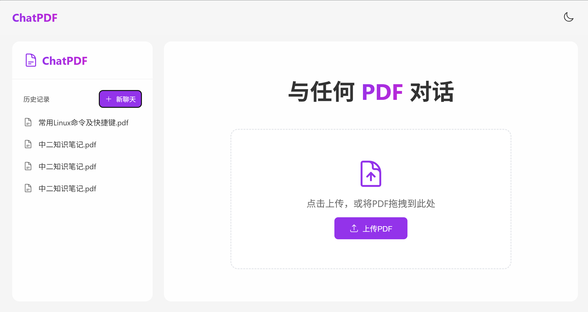
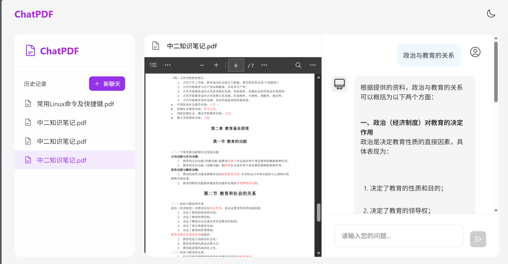

# ChatPDF - 基于 RAG 的 PDF 智能问答系统

[English](#english) | [中文](#中文)

---

## 📖 项目简介

本项目是一个基于 **RAG（检索增强生成）技术** 的 PDF 智能问答系统。用户上传 PDF 文档后，可以针对文档内容进行自然语言问答，系统通过向量检索找到最相关的 PDF 片段，结合大语言模型生成准确答案。

**核心特性：**

- 🤖 **双模式对话**：支持「RAG 模式」（严格基于文档）和「对话模式」（文档 + AI 知识联合回答，支持自定义 System Prompt 深度拓展）
- 📤 **文件存储**：PDF 文件自动上传至阿里云 OSS，对话历史持久化到 MySQL，向量数据本地序列化
- 💬 **流式响应**：SSE 流式输出，打字机效果，支持 Markdown 渲染与代码高亮
- 🌙 **暗色模式**：跟随系统偏好，支持手动切换
- 💾 **会话持久化**：重启后自动恢复对话历史与向量数据

**技术栈：** Vue 3 + Vite 前端 / Spring Boot 3 + Spring AI 后端，对接 **DeepSeek Chat** 大模型 + **阿里云百炼（DashScope）** 向量化服务 + **阿里云 OSS** 文件存储 + **MySQL** 持久化。

---

## 🗂️ 项目结构

```
pdf-/
├── rag_front/                         # 前端（Vue 3 单页应用）
│   ├── src/
│   │   ├── App.vue                     # 根组件（导航栏 + 暗色模式 + 路由视图）
│   │   ├── main.js                     # 应用入口（创建 Vue 实例、注册 Pinia + Router）
│   │   ├── views/
│   │   │   └── ChatPDF.vue             # 主页面（侧边栏 + 对话区 + PDF预览 + 模式切换）
│   │   ├── components/
│   │   │   ├── ChatMessage.vue          # 消息气泡（Markdown 渲染 + 代码高亮 + 复制按钮）
│   │   │   └── PDFViewer.vue           # PDF 预览（OSS 代理 / Blob URL + iframe）
│   │   ├── services/
│   │   │   └── api.js                  # API 封装层（流式 Fetch + 双模式支持）
│   │   ├── router/
│   │   │   └── index.js               # 路由配置（History 模式，根路径指向 ChatPDF）
│   │   └── assets/
│   │       └── main.css               # 全局样式重置
│   ├── index.html
│   ├── package.json
│   └── vite.config.js
│
├── rag_end/
│   └── RAG_Practice/                   # 后端（Spring Boot 3 + Spring AI）
│       ├── src/main/java/com/hyltest/rag_practice/
│       │   ├── RagPracticeApplication.java    # 启动类，@MapperScan 扫描 MyBatis Mapper
│       │   ├── config/
│       │   │   ├── CommonConfiguration.java  # ChatMemory Bean 配置（JdbcChatMemoryRepository）
│       │   │   ├── MvcConfiguration.java      # CORS 跨域配置
│       │   │   └── SpringAIConfiguration.java # 向量存储 + 双 ChatClient Bean 配置
│       │   ├── controller/
│       │   │   ├── PdfController.java         # PDF 上传/下载/预览/信息查询/双模式对话
│       │   │   └── ChatHistoryController.java # 会话历史列表 + 消息历史查询
│       │   ├── service/
│       │   │   ├── IFileService.java          # 文件服务接口
│       │   │   └── impl/
│       │   │       └── FileServiceImpl.java   # OSS 上传 + PDF 解析向量化 + 数据库持久化
│       │   ├── repository/
│       │   │   ├── FileRepository.java              # 文件仓储接口（本地文件存储实现，现已废弃）
│       │   │   ├── ChatHistoryRepository.java      # 会话历史仓储接口
│       │   │   ├── LocalPdfFileRepository.java      # PDF 本地文件存储实现（现已废弃）
│       │   │   └── InMemoryChatHistoryRepository.java # 会话历史 + 对话记忆持久化（JSON 文件）
│       │   ├── entity/
│       │   │   ├── po/
│       │   │   │   ├── Msg.java                    # 消息持久化实体（配合 InMemoryChatHistoryRepository）
│       │   │   │   └── FileMapper.java             # 文件映射实体（对应 file_mapper 表）
│       │   │   ├── mapper/
│       │   │   │   └── FileMapperMapper.java       # MyBatis Mapper（纯注解 SQL，无 XML）
│       │   │   └── vo/
│       │   │       ├── Result.java                  # 统一响应封装（{ok, msg, data}）
│       │   │       ├── ChatHistoryVO.java          # 会话历史 VO（id/title/fileName）
│       │   │       └── MessageVO.java              # 消息 VO（role/content）
│       │   └── utils/
│       │       ├── AliyunOSSOperator.java          # 阿里云 OSS 上传工具类
│       │       ├── AliyunOSSProperties.java         # 阿里云 OSS 配置属性类
│       │       └── VectorDistanceUtils.java        # 向量距离计算工具（欧氏距离/余弦相似度）
│       └── src/main/resources/
│           ├── application.yml                     # 配置文件（API Key / 数据库 / OSS）
│           └── lombok.config                       # Lombok 配置
│
└── [报告模板].docx
```

---

## 🛠️ 技术栈

### 前端

| 技术 | 版本 | 作用 |
|------|------|------|
| **Vue 3** | 3.5 | 渐进式前端框架，Composition API |
| **Vite** | 6.3 | 下一代前端构建工具，HMR 热更新 |
| **Pinia** | 3.x | 状态管理（main.js 已注册，实际页面组件内直接用 ref） |
| **Vue Router** | 4.x | 客户端路由（History 模式） |
| **@vueuse/core** | latest | Vue Composition API 工具集（暗色模式 useDark/useToggle） |
| **@heroicons/vue** | latest | 图标库（太阳/月亮切换按钮） |
| **marked** | latest | Markdown 解析 |
| **highlight.js** | latest | 代码语法高亮 |
| **DOMPurify** | latest | XSS 安全防护（Markdown 输出过滤） |
| **sass** | 1.85+ | CSS 预处理器（App.vue 使用 SCSS 嵌套语法） |

### 后端

| 技术 | 版本 | 作用 |
|------|------|------|
| **Spring Boot** | 3.4.5 | 后端框架 |
| **Spring AI** | 1.0.0 | AI 能力抽象层 |
| **spring-ai-alibaba-starter-dashscope** | 1.0.0.2 | 阿里云百炼 DashScope 集成（Embedding 向量化） |
| **spring-ai-starter-model-deepseek** | 1.0.0 | DeepSeek Chat 模型集成 |
| **spring-ai-advisors-vector-store** | 1.0.0 | 向量存储 Advisor（QuestionAnswerAdvisor） |
| **spring-ai-pdf-document-reader** | 1.0.0 | PDF 解析（PagePdfDocumentReader） |
| **spring-ai-vector-store** | 1.0.0 | 向量存储接口（SimpleVectorStore） |
| **spring-ai-starter-model-chat-memory-repository-jdbc** | 1.0.0 | JDBC 对话历史持久化（JdbcChatMemoryRepository） |
| **MyBatis** | 3.0.5 | ORM 框架（纯注解 Mapper，无 XML） |
| **MySQL** | — | 数据库（对话历史 + 文件映射关系） |
| **阿里云 OSS SDK** | 3.17.4 | 对象存储（文件上传/下载） |
| **Lombok** | latest | 简化代码 |

### AI 服务

| 服务 | 用途 |
|------|------|
| **DeepSeek Chat** (`deepseek-chat`) | 对话生成 |
| **DashScope Embedding** (`text-embedding-v4`) | 文本向量化（1024 维） |

---

## 🔌 API 接口

**Base URL：** `http://localhost:8080`

### 文件管理

| 接口 | 方法 | 说明 | 返回 |
|------|------|------|------|
| `/ai/pdf/upload/{chatId}` | `POST` | 上传 PDF 文件到 OSS，建立会话映射 | `{"ok":1,"data":"<OSS URL>"}` |
| `/ai/pdf/file/{chatId}` | `GET` | 下载 PDF（Content-Disposition: inline，浏览器内预览） | `application/pdf` |
| `/ai/pdf/preview/{chatId}` | `GET` | PDF 预览代理（解决 OSS URL 直接访问触发下载的问题） | `application/pdf` |
| `/ai/pdf/info/{chatId}` | `GET` | 获取会话文件信息（URL / 文件名 / 标题） | `{"ok":1,"data":{url,fileName,title}}` |

### 对话（双模式）

| 接口 | 方法 | 说明 | 返回 |
|------|------|------|------|
| `/ai/pdf/chatRag` | `GET` | **RAG 模式** — 严格基于文档内容回答，自动向量检索 | `text/html` SSE 流 |
| `/ai/pdf/chat` | `GET` | **对话模式** — 文档 + AI 知识联合回答，支持深度拓展 | `text/html` SSE 流 |

> 两个对话接口均支持 `prompt`（用户问题）和 `chatId`（会话 ID）参数。首次对话时 chatId 可传 null，服务端自动生成。

### 会话历史

| 接口 | 方法 | 说明 | 返回 |
|------|------|------|------|
| `/ai/history/{type}` | `GET` | 获取指定类型的所有会话历史列表 | `[{id,title,fileName}]` |
| `/ai/history/{type}/{chatId}` | `GET` | 获取指定会话的消息历史 | `[{role,content}]` |

> ⚠️ **注意**：生产环境请务必在 `application.yml` 中配置所有环境变量（API Key / 数据库密码 / OSS 凭证），并添加身份认证机制。

---

## 🔄 系统架构

### 双模式对话流程

```
用户上传PDF
    │
    ▼
┌─────────────────────────────────────────────┐
│  1. PDF 解析 (PagePdfDocumentReader)       │
│     每页 PDF 作为一个 Document               │
└────────────────────┬──────────────────────┘
                     ▼
┌─────────────────────────────────────────────┐
│  2. 向量化 (DashScope text-embedding-v4)    │
│     1024 维向量，存入 SimpleVectorStore      │
└────────────────────┬──────────────────────┘
                     ▼
┌─────────────────────────────────────────────┐
│  3. OSS 上传 (AliyunOSSOperator)            │
│     文件存至阿里云 OSS，URL 记入 MySQL       │
└────────────────────┬──────────────────────┘
                     ▼
          用户提问 prompt
             │
    ┌────────┴────────┐
    │                 │
    ▼                 ▼
 ┌────────┐     ┌──────────┐
 │RAG模式  │     │对话模式  │
 │/chatRag │     │/chat     │
 └───┬────┘     └───┬──────┘
     │               │
     ▼               ▼
  QuestionAnswer     手动 similaritySearch
  Advisor 自动检索   topK=5, 阈值0.7
  topK=2, 阈值0.5    ↓
     │          System Prompt 组装
     ▼          文档内容+自定义提示词
  MessageChat       ↓
  Memory Advisor    MessageChatMemory Advisor
  (JDBC MySQL)      (JDBC MySQL)
     │               │
     └───────┬───────┘
             ▼
   ┌─────────────────────┐
   │  DeepSeek 生成答案   │
   │  流式 SSE 输出       │
   └─────────────────────┘
```

### 双 ChatClient 配置

| Bean 名称 | Advisors | 用途 |
|----------|---------|------|
| `pdfChatClient` | SimpleLoggerAdvisor + MessageChatMemoryAdvisor + **QuestionAnswerAdvisor** | RAG 模式，自动向量检索 |
| `chatClient` | SimpleLoggerAdvisor + MessageChatMemoryAdvisor | 对话模式，自定义 System Prompt |

---

## 📂 数据持久化

| 存储层 | 数据 | 说明 |
|--------|------|------|
| **MySQL** | `file_mapper` 表 | 会话 ID ↔ 文件名 ↔ OSS URL 的映射关系 |
| **MySQL** | `AI_CONVERSATION` 等表 | Spring AI 自动创建，存储对话历史（JdbcChatMemoryRepository） |
| **本地文件** | `chat-pdf.json` | SimpleVectorStore 向量数据序列化 |
| **本地文件** | `chat-history.json` | 会话历史列表（InMemoryChatHistoryRepository 备用） |
| **本地文件** | `chat-memory.json` | 对话消息记录（InMemoryChatHistoryRepository 备用） |

> ⚠️ `SimpleVectorStore` 为内存向量库，`@PreDestroy` 时持久化到 `chat-pdf.json`，`@PostConstruct` 时恢复。生产环境建议迁移至 Milvus / Qdrant 等专业向量数据库。

---

## 🚀 快速开始

### 环境要求

- **JDK 17+**
- **Node.js 18+**
- **Maven 3.8+**
- **MySQL 8.0+**（需提前创建 `rag` 数据库）
- DeepSeek API Key（[获取地址](https://platform.deepseek.com/usage)）
- 阿里云百炼 API Key（[获取地址](https://bailian.console.aliyun.com/)）
- 阿里云 OSS 凭证（AK/SK 环境变量 + 已配置的 Bucket）

### 1. 配置环境变量

```bash
# 后端：Spring AI 相关
export DS_API_KEY="your-deepseek-api-key"
export QWEN_API_KEY="your-dashscope-api-key"

# 后端：阿里云 OSS
export OSS_ACCESS_KEY_ID="your-access-key-id"
export OSS_ACCESS_KEY_SECRET="your-access-key-secret"
export ENDPOINT="oss-cn-xxx.aliyuncs.com"
export BUCKET_NAME="your-bucket-name"
export REGION="cn-xxx"

# 后端：MySQL
# 需提前创建数据库：CREATE DATABASE rag CHARACTER SET utf8mb4;
```

### 2. 初始化数据库

Spring AI 的 `JdbcChatMemoryRepository` 会根据 `spring.ai.chat.memory.repository.jdbc.initialize-schema: always` 配置**自动创建**所需的 `AI_CONVERSATION` 等数据表。只需手动创建 `rag` 数据库：

```sql
CREATE DATABASE IF NOT EXISTS rag CHARACTER SET utf8mb4 COLLATE utf8mb4_unicode_ci;
```

### 3. 启动后端

```bash
cd rag_end/RAG_Practice

# 开发模式
./mvnw spring-boot:run

# 或打包后运行
./mvnw clean package -DskipTests
java -jar target/RAG_Practice-0.0.1-SNAPSHOT.jar
```

后端地址：`http://localhost:8080`

### 4. 启动前端

```bash
cd rag_front

npm install

npm run dev     # 开发模式
npm run build   # 生产构建
```

前端地址：`http://localhost:5173`

### 5. 使用

1. 打开 `http://localhost:5173`
2. 点击上传区域或拖拽 PDF 文件
3. 等待向量化和 OSS 上传完成（控制台可见进度日志）
4. 选择对话模式：
   - **RAG 模式**：严格基于 PDF 内容回答，适合事实性问题
   - **对话模式**：AI 在文档基础上深度拓展，适合分析、总结类问题
5. 在对话框中输入问题，AI 流式返回答案

---

## 📝 关键实现

### 前端：双模式切换 + 流式响应

```javascript
// services/api.js
const endpoint = mode === 'rag' ? '/ai/pdf/chatRag' : '/ai/pdf/chat'

// 流式读取
const reader = response.body.getReader()
while (true) {
  const { done, value } = await reader.read()
  if (done) break
  aiMessageContent.value += new TextDecoder().decode(value)
}
```

### 后端：RAG 模式对话

```java
// PdfController.java - /chatRag
// pdfChatClient 已内置 QuestionAnswerAdvisor + MessageChatMemoryAdvisor
// 只需通过 advisors() 传递动态参数，不要重复添加 Advisor
return pdfChatClient.prompt()
    .advisors(spec -> spec
        .param(ChatMemory.CONVERSATION_ID, chatId)
        .param(QuestionAnswerAdvisor.FILTER_EXPRESSION, "chat_id == '" + chatId + "'"))
    .user(prompt)
    .stream().content();
```

### 后端：对话模式对话

```java
// PdfController.java - /chat
// 手动检索文档 + 自定义 System Prompt
List<Document> docs = vectorStore.similaritySearch(SearchRequest.builder()
    .query(prompt).topK(5).similarityThreshold(0.7)
    .filterExpression("chat_id == '" + chatId + "'").build());

String systemPrompt = "你是一位文档分析专家，请根据参考文档回答，必要时拓展补充...";

return chatClient.prompt()
    .system(s -> s.text(systemPrompt).param("context", formattedDocs))
    .advisors(spec -> spec.param(ChatMemory.CONVERSATION_ID, chatId))
    .stream().content();
```

### 后端：PDF 向量化 + OSS 上传

```java
// FileServiceImpl.java
String fileUrl = aliyunOSSOperator.upload(bytes, filename);        // 上传 OSS
chatHistoryRepository.save("pdf", chatId, filename, fileUrl);     // 记录 MySQL
// 解析 PDF → 写入向量库
PagePdfDocumentReader reader = new PagePdfDocumentReader(resource,
    PdfDocumentReaderConfig.builder().withPagesPerDocument(1).build());
List<Document> docs = reader.read();
docs.forEach(doc -> doc.getMetadata().put("chat_id", chatId));
vectorStore.add(docs);
```

---

## 📊 项目截图




---

## 🔧 生产环境注意事项

1. **API Key 安全**：切勿将 API Key 提交到 Git，添加到 `.gitignore`，使用环境变量或 Vault 管理
2. **数据库密码**：在 `application.yml` 中使用环境变量 `${DB_PASSWORD}` 而非明文
3. **OSS 凭证**：AK/SK 必须通过环境变量注入，不要写入配置文件
4. **CORS 配置**：`MvcConfiguration.java` 中的跨域配置仅适用于开发环境，生产环境请使用 Nginx 反向代理
5. **向量库升级**：当前使用 `SimpleVectorStore`（内存），生产环境建议迁移到 Milvus、Qdrant 等专业向量数据库
6. **文件存储**：当前使用阿里云 OSS，适合生产环境；如切换云厂商，仅需替换 `AliyunOSSOperator` 实现
7. **身份认证**：建议增加 JWT 认证、用户管理和会话隔离机制

---

## 📚 参考资料

- [Spring AI 官方文档](https://spring.io/projects/spring-ai)
- [DeepSeek API 文档](https://platform.deepseek.com/)
- [阿里云百炼 DashScope](https://bailian.console.aliyun.com/)
- [阿里云 OSS SDK 文档](https://help.aliyun.com/zh/oss/)
- [Vue 3 官方文档](https://vuejs.org/)
- [大模型应用开发实践：基于Spring AI+DeepSeek实现](https://book.douban.com/) — 赖帆

---

## 📄 License

MIT License

---

## English

### ChatPDF - PDF Intelligent Q&A System Based on RAG

This is a **Retrieval-Augmented Generation (RAG)** based PDF intelligent Q&A system built with **Vue 3** (frontend) and **Spring Boot 3 + Spring AI** (backend). Users can upload PDF documents and ask natural language questions about the content.

**Key Features:**

- 🤖 **Dual-Mode Chat**: RAG mode (strict document-based answers) and Chat mode (document + AI knowledge combined, with custom System Prompt)
- 📤 **Cloud Storage**: PDFs uploaded to Aliyun OSS, chat history persisted to MySQL
- 💬 **Streaming Responses**: SSE streaming with typewriter effect, Markdown + syntax highlighting
- 🌙 **Dark Mode**: Follows system preference with manual toggle
- 💾 **Persistent Sessions**: Auto-restores chat history and vector store on restart

**Tech Stack:** Vue 3 / Vite / Pinia / Spring Boot 3 / Spring AI / DeepSeek / DashScope / MyBatis / MySQL / Aliyun OSS

**API Endpoints:**

| Endpoint | Method | Description |
|----------|--------|-------------|
| `/ai/pdf/upload/{chatId}` | POST | Upload PDF to OSS |
| `/ai/pdf/chatRag` | GET | RAG-mode Q&A (streaming) |
| `/ai/pdf/chat` | GET | Chat-mode Q&A (streaming) |
| `/ai/pdf/preview/{chatId}` | GET | PDF preview proxy |
| `/ai/history/{type}` | GET | Chat history list |
| `/ai/history/{type}/{chatId}` | GET | Chat messages |
